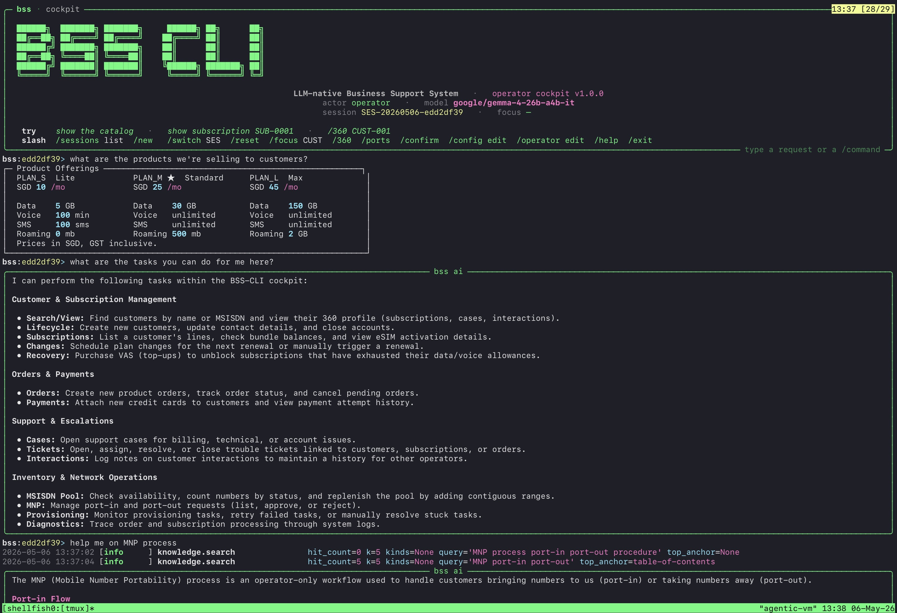
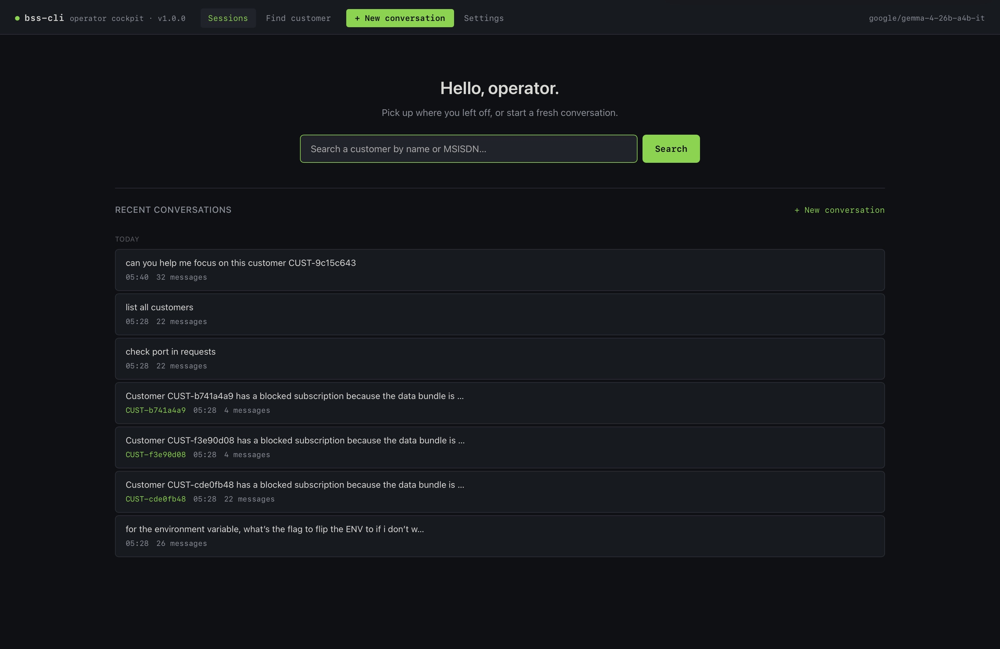
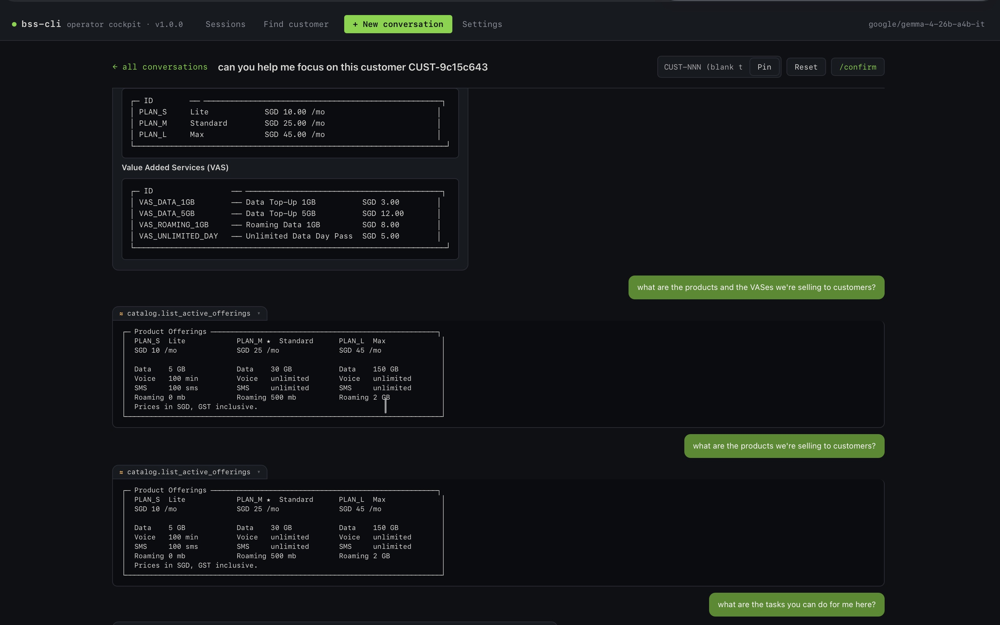
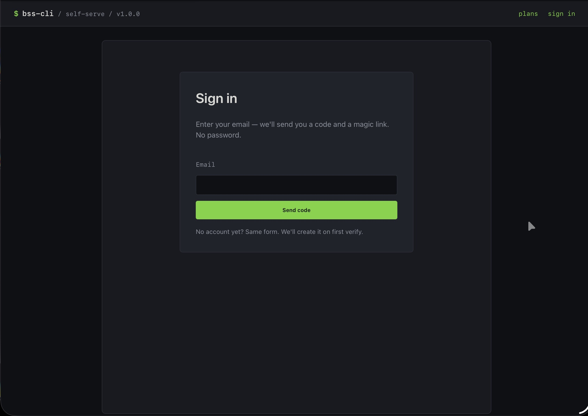
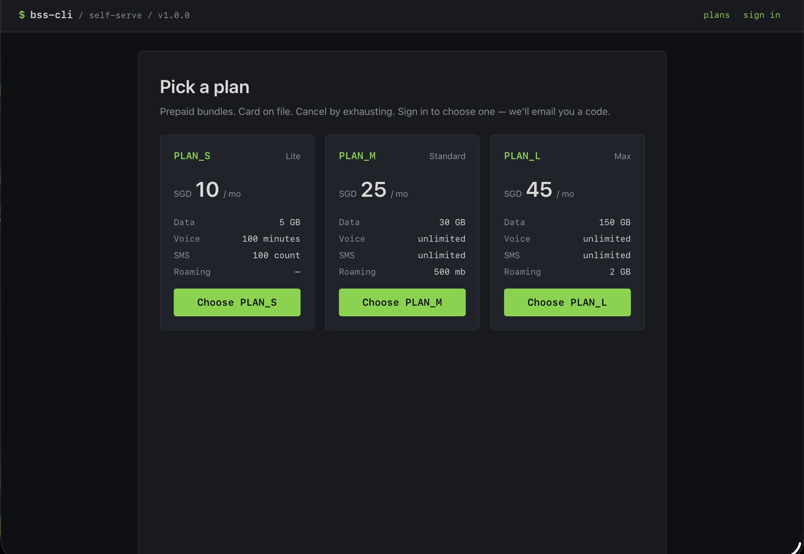

# BSS-CLI

A complete Business Support System for a small prepaid MVNO, run from a terminal.

Nine TMF-compliant services (Catalog, CRM, Payment, COM, SOM, Subscription,
Mediation, Rating, Provisioning-sim), two web portals (customer self-serve on
9001, operator cockpit on 9002), and a CLI/REPL. Every operation is a tool an
LLM can call; every write goes through a policy layer, so the LLM can't
corrupt state even when asked to.

Use it to learn telco BSS/OSS, run a small MVNO MVP, or experiment with
agents against realistic telco operations.

**Scope, by design:** eSIM-only, bundled-prepaid, block-on-exhaust,
card-on-file mandatory. No eKYC, no network elements, no batch CDR, no OCS —
those are channel/network concerns. See [`ROADMAP.md`](ROADMAP.md) for
what shipped in each release and what's out of scope.

## Screenshots

**Operator cockpit — REPL.** Type natural language; the agent calls tools;
results render as ASCII cards. Slash commands (`/ports`, `/360`, `/focus`,
`/confirm`) cover deterministic flows.



**Operator cockpit — browser.** Same conversation store as the REPL, plus
full CRM screens (Customers, Cases, Orders, Catalog, Subscriptions).
Destructive actions sit behind a two-step confirm; every screen can hand off
to the agent with a drafted message.





**Self-serve portal.** Signup, plans, top-ups, eSIM, billing, and a scoped
support chat.





**Distributed tracing.** `bss trace for-order ORD-0014` renders the span tree
across services as an ASCII swimlane; Jaeger has the full UI.


## Quick start

Prerequisites: Docker + Compose, a [Rust toolchain](https://rustup.rs) (to build the
service images + the `bss` CLI), and an OpenRouter API key (or any OpenAI-compatible
endpoint) for the chat/REPL. (BSS-CLI is all-Rust as of 2.0; the original Python
implementation was retired at v2.0.0 — see [`docs/PYTHON-ORACLE.md`](docs/PYTHON-ORACLE.md).)

```bash
git clone <repo> && cd bss-cli
cp .env.example .env

# Generate a real API token (the sentinel value refuses to boot)
sed -i "s/^BSS_API_TOKEN=changeme$/BSS_API_TOKEN=$(openssl rand -hex 32)/" .env
# Then edit .env: set BSS_LLM_API_KEY

# Bring up the all-Rust service plane + portals + infra (Postgres/RabbitMQ/Jaeger)
docker compose -f docker-compose.yml -f docker-compose.rust.yml -f docker-compose.infra.yml up -d

cargo build --release -p bss-cli && export PATH="$PWD/target/release:$PATH"
bss admin migrate            # apply the schema (sqlx baseline); --baseline on an existing DB
make seed                    # plans, VAS, 1000 MSISDNs, 1000 eSIM profiles
make knowledge-reindex       # cockpit doc search corpus

bss                          # operator cockpit REPL
open http://localhost:9001/  # customer self-serve portal
open http://localhost:9002/  # operator cockpit (browser)
open http://localhost:16686/ # Jaeger traces
```

Already have Postgres and RabbitMQ? Skip `docker-compose.infra.yml`, set
`BSS_DB_URL` / `BSS_RABBITMQ_URL` in `.env`, and run
`CREATE EXTENSION IF NOT EXISTS vector` on the database first
(the knowledge tool needs pgvector).

### Try it

```bash
make scenarios                    # 19 hero scenarios (~100s) — sanity-check the install
bss subscription show SUB-0001
bss trace for-order ORD-0001
bss admin knowledge search "rotate cockpit token"
bss branding set-theme ice        # v1.8 — retheme both portals + emails, live
make demo-restore                 # reset to a clean demo dataset (3 customers, 2 promos)
make e2e                          # Playwright suite with screenshot/video galleries
```

## How it hangs together

- **Writes** always flow router → service → policy → repository. The policy
  layer validates state machines, ownership, and domain invariants before
  anything touches the database, and every change emits an audit event.
- **Three write paths** feed that chokepoint: direct calls via `bss-clients`
  (CLI, signup, self-serve routes), the LLM orchestrator (the chat surfaces
  only), and background workers (subscription renewal). Same policies, same
  audit trail, whoever the caller is.
- **Customers** get a scoped tool profile — ownership-bound wrappers, usage
  caps, and five escalation categories that always open a case instead of
  letting the bot improvise.
- **Operators** get the full tool surface in the REPL/cockpit, with
  destructive actions gated behind propose-then-`/confirm`.
- **Branding** (v1.8): operator name, theme, and logo are config — edit them
  at cockpit → Branding and both portals, emails, and the REPL follow.

[`ARCHITECTURE.md`](ARCHITECTURE.md) has the topology and call patterns;
[`docs/HANDBOOK.md`](docs/HANDBOOK.md) is the single-file operator manual.

## Documentation

- [`docs/HANDBOOK.md`](docs/HANDBOOK.md) — operator handbook: setup, env vars, providers, features, runbooks
- [`ARCHITECTURE.md`](ARCHITECTURE.md) — topology, call patterns, deployment paths
- [`CLAUDE.md`](CLAUDE.md) — project doctrine and invariants
- [`DATA_MODEL.md`](DATA_MODEL.md) — schemas and tables
- [`TOOL_SURFACE.md`](TOOL_SURFACE.md) — every LLM tool, args and returns
- [`ROADMAP.md`](ROADMAP.md) — release history, plans, non-goals
- [`DECISIONS.md`](DECISIONS.md) — architectural decision log
- [`phases/`](phases/) — per-release build plans
- [`docs/runbooks/`](docs/runbooks/) — operational procedures

## License

Apache-2.0
